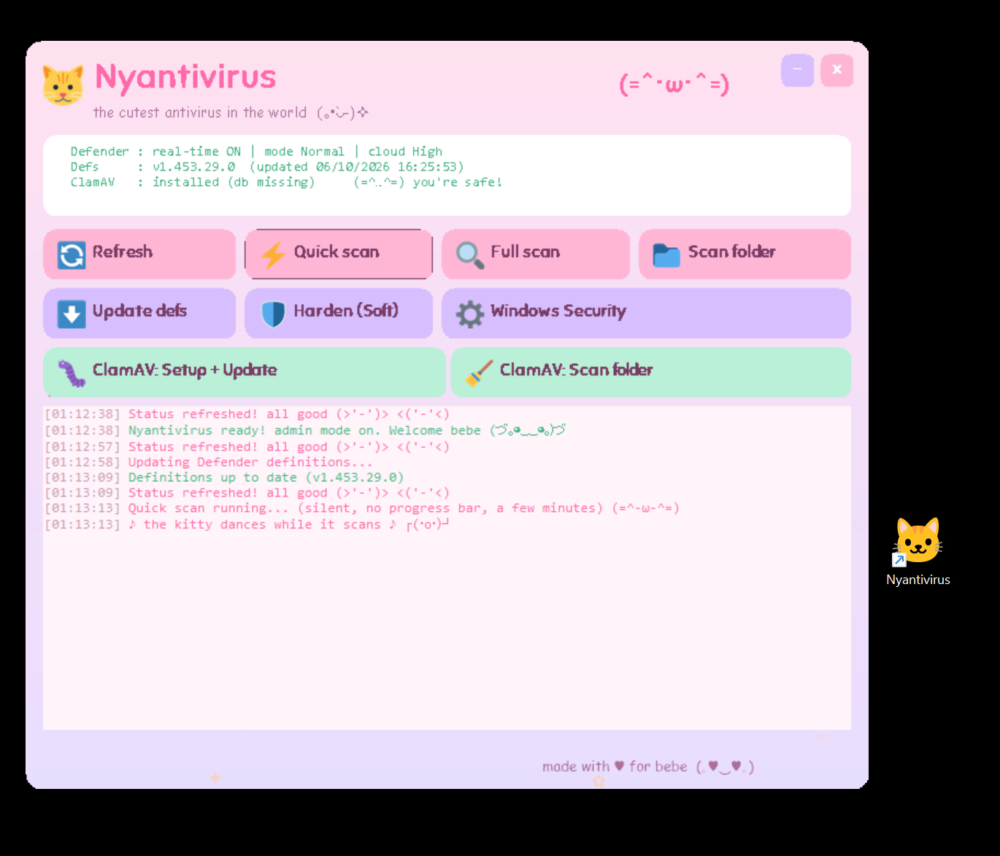

<div align="center">

# 🐱 Nyantivirus

### the cutest antivirus in the world `(=^･ω･^=)`

A kawaii control panel for **Microsoft Defender** + **ClamAV** on Windows.
Free, open source, no telemetry, ridiculously cute.



</div>

## ✨ What is this?

Nyantivirus is a single-file PowerShell + WinForms app that gives you a friendly,
pastel, animated front-end to the security tools already on your Windows PC.
It doesn't replace your antivirus, it **drives** the powerful ones (Microsoft
Defender and ClamAV) through a UI a cat would approve of.

## 🛡️ Features

- **Defender control**: quick / full / folder scans, definition updates, live status
- **Background scans**: scans run in the background and the kitty tells you when it's done (with sound)
- **Soft hardening**: one click to raise cloud protection, PUA and MAPS to recommended levels
- **ClamAV second opinion**: setup, virus-db update (freshclam) and on-demand folder scans
- **Threats viewer**: list & remove Defender detections, drop an **EICAR test** to prove protection works
- **Scan history**: every scan is logged to `scan-history.log`
- **Minimize to tray**: tuck the app into the system tray with desktop notifications on scan completion
- **Maximum kawaii**: falling petals during scans, a dancing cat mascot, confetti when you're clean,
  floating hearts, a sparkly UI, and a little "nya" melody on launch 🎵

## 🚀 Install (no terminal needed)

For non-technical users, the easy way:

1. On this page, click the green **Code** button, then **Download ZIP**.
2. **Extract** the ZIP somewhere (Desktop, Documents, wherever you like).
3. Open the extracted folder and **double-click `Setup.bat`**.
4. Accept the prompt. A **Nyantivirus** shortcut (cat icon) appears on your Desktop.
5. Double-click the cat icon, accept the Windows admin prompt, and enjoy.

> First run: click **Harden (Soft)**, then **ClamAV: Setup + Update** (downloads the virus db, about 150 MB).

## 🧑‍💻 Install (developers)

```powershell
git clone https://github.com/AfedB/Nyantivirus.git
cd Nyantivirus
powershell -ExecutionPolicy Bypass -File .\install.ps1
```

## 📋 Requirements

- Windows 10 or 11
- Windows PowerShell 5.1 (built in)
- Admin rights (the app auto-elevates via UAC, Defender settings require it)
- (optional) [ClamAV](https://www.clamav.net/) installed at `C:\Program Files\ClamAV` for the second-opinion scanner

## 🗂️ Project layout

```
Nyantivirus.ps1   the app (UI + logic)
Nyantivirus.bat   launcher (hidden console)
Setup.bat         double-click installer for non-tech users
install.ps1       creates desktop + start menu shortcuts
nyantivirus.ico   cat icon
assets/           bundled font (Sniglet) + Twemoji color emojis + mascots
docs/             screenshots
```

## 🙏 Credits

See [ATTRIBUTION.md](ATTRIBUTION.md). Built with Twemoji, Sniglet and Noto Emoji, all open licenses.

## ⚖️ License

Code released under the [MIT License](LICENSE). Bundled assets keep their own licenses (see ATTRIBUTION).

<div align="center">

made with ♥ `(づ｡◕‿‿◕｡)づ`

</div>
